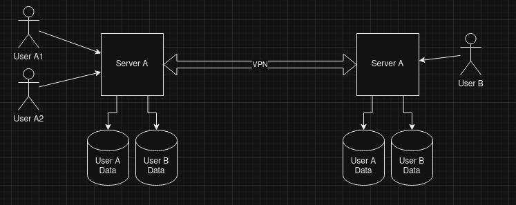

# Introduction
Online backup solutions are not your own, they are owned by the company you sign up with and if they loose your valuable photos of your children; well it's not in their interst, but then again it's not their loss either.

The idea behind this project is to create a distributed solution which, in which you can set up a server locally to back things up too. You then get one or more friends to do the same and link the servers into a collection of nodes to perform offsite replicas of your data which allow the following:

- Backup/File Store
  - Local backup for all devices in my house (phone, laptop, tablet, desktop) for all users.
    - All files encrypted on a per user basis.
  - Remote / off site copy of this backup.
  - End to end encryption
  - Encryption in transit and at rest - we don't want anyone else accessing your data.
- Local and remote access so you can pick up your data anywhere.

The theory is that this computer is on 24x7 and also offers the following additional, in home, services:
- File streaming/transcoding - so you can watch your videos / movies on any device.
- VPN to allow connectivity from anywhere to allow secure connections over public wifi.
- Docker server to run apps, containers, etc.
- LAMP stack. Hey I'm a dev at heart!
- OwnCloud / NextCloud to allow applications to be run.
  - Could OC/NC connect and pull files from the store?
- SSH control.
- PiHole.

## Savings
At present a lot of people pay for individual services which cost cold, hard cash.

Microsoft Office Family £79.99 per annum - £6.67 per month
Website Hosting - £11 per month (approx)
VPN - £7 (approx)

These things along are now costing just under £25 per month, which is about £300 per annum.  If we then add on things like docker (cloud computing) and file streaming services, and then scale it up for a family of 4 - this becomes very costly indeed. 

# Functionality

## Backup/File Store
The primary purpose for this is to regain control of my own data without submitting to Google, Microsoft apple or whoever else, It's my data and I have a vested interest to ensure that this is a secure as possible for the future.

### Local backup
I have tried using a remote server to pull my files from, it's sometimes slow. We need this to be local so it's as fast as possible. 

As this will be transferred to the Remote backup - it must be encrypted in transit and at rest!

### Remote backup
Should the worst happen (disk failure, flood, fire, theft, etc) we need a copy of my data offsite. I want this to be achievable via copying all files to cloud storage, BLOB storage, external hard disk or another instance of this solution via the a VPN connection and end to end encryption.  We should be able to set multiple locations (copy to Amazon, Ext Hard disk and another copy of this).

Cloning to another version of this can be done in a symbiotic solution where 2 people run the same solution, both of them dedicate a disk to the other persons backup. Starting with a small disk and increasing as necessary.

## File Streaming
I don't pay for a TV license, as I don't watch British TV. So all my entertainment is done through streaming services, but if the Internet goes down, I'm stuck for things to watch.

I'd like a library of films, etc I can watch without the need for Internet access.

## File Sharing (SAMBA)
Public / Private file shares - allow sharing within the household only, or share with the symbiotic client, publicly accessible.

## VPN (OpenVPN)
Allow me access to my files whilst on the move, not essential as it could synchronise only when on local network.

As I have a mistrust of public wifi - essentially this would allow me secure access to the internet as well.

Either way - the symbiotic solution must use VPN to synchronise files.

## Server which can run docker, websites (Docker / NGINX / Apache)

I have need of adhoc stiuff - call me geeky.

## Office (NextCloud / OwnCloud)

I presently pay per month for a NextCloud instance.  Enough said.

## Marketing / tracker blocking (PiHole)
It must run a PiHole to avoid tracking and other marketing bullshit - no questions, this is a must.

# Proof of Concept

So I am doing a POC using Ubuntu and [Multipass](https://multipass.run/). Start by installing Multipass to allow us to stand up / stop servers pretty quickly

    $ sudo snap install multipass

Now we have Multipass, I have added a public / private key pair into the POC folder of this project.

> Username:  user
> 
> Password:  

Thats right - there is no password, secure I know, but I wouldnt put this into production.

Now I have created public/private keys for the user and a config yaml file - so let's fire up the server using:

    $ multipass launch -n LocalServer --cloud-init server-init.yaml
    $ multipass launch -n RemoteServer --cloud-init server-init.yaml
    

If you need any help with Multipass commands, check out their [documentation](https://multipass.run/docs). 

If you need help with Cloud-Init YAML configuration, check out the [examples](https://cloudinit.readthedocs.io/en/latest/reference/examples.html) and overall [documentation](https://cloudinit.readthedocs.io/en/latest/).

Once we have the servers up and running we will need the IP addresses.

    $ multipass list

will give you something like the following:

    Name                    State             IPv4             Image
    LocalServer             Running           10.61.187.229    Ubuntu 22.04 LTS
    RemoteServer            Running           10.61.187.177    Ubuntu 22.04 LTS

The IP address is right there, 3rd column.

Now we can connect to it using the following:

    $ ssh user@<IP ADDRESS> -i multipass-ssh-key -o StrictHostKeyChecking=no

This will then log you into the Ubuntu 22.04 server.

We can now install items which will be reflected in the ISO located at ``/var/snap/multipass/common/data/multipassd/vault/instances/*``

## Next Steps
Using the --cloud-init file format, we can initialise users, groups, install packages, etc.  This can then allow you to play with the configuration.

## Next Next Steps

Once we have it working in a POC, we want to scale it so it's usable:

- Create a VM image
- Create an ISO
- Create a set of scripts you can amend and run once a suitable OS has been procured - we don't want to limit you to just Ubuntu.

# Components
We will need some hardware to run this on, and to ensure we get maximum savings, power efficiency is a musy.

Ideally it will be an ultra low power to run 24x7 or shutdown at certain times and startup at certain times.  No matter what, if it's going to cost a fortune to run, it's a no no.

An ideal candidate is the latest Raspberry Pi, using the following components (all available from PiHut or Amazon)

**Raspberry Pi 5 (8GB)**
[PiHut](https://thepihut.com/products/raspberry-pi-5?variant=42531604955331) | 
[Amazon UK](https://amzn.to/3Tv7ix8)
 
**Raspberry Pi 5 USB-C Power Supply UK Plug**
[PiHut](https://thepihut.com/products/raspberry-pi-27w-usb-c-power-supply?variant=42531604103363) |
[Amazon UK](https://amzn.to/3ZoZYHa)

**Raspberry Pi Active Cooler for Raspberry Pi 5**
[PiHut](https://thepihut.com/products/active-cooler-for-raspberry-pi-5?variant=42531603906755) |
[Amazon UK](https://amzn.to/3TxEXGO)

**KKSB Cases Case for Raspberry Pi 5 with Space for Hats, Add-on Boards, Coolers, and NVMe Hats**
[PiHut](https://thepihut.com/products/kksb-raspberry-pi-5-case-for-hats-and-coolers?variant=43516709437635) |
[Amazon UK](https://amzn.to/3XsvIZv)

**Dual M.2 NVMe SSD Shield PCIe Peripheral Board for Raspberry Pi 5**
[PiHut](https://thepihut.com/products/hatdrive-dual-for-raspberry-pi-5?variant=43658329653443) |
[Amazon UK](https://amzn.to/3TtdLJ4)

**WD_BLACK SN770 1TB NVMe M.2 SSD**
[Amazon Only](https://amzn.to/3Tv7lsO)

You may need 2 of these, depending on the configuration or you may need increased capacity.

If you are looking for a full on Intel based computer, then the following is also an option, but more expensive:

[Odroid H3+](https://www.odroid.co.uk/H3-Plus)

### CPU
This needs to be able to cope with the demands of serving files and running an office system.

### Network
Wifi is now fast enough, but if you really need ultra fast, then a gigabit ethernet connection.

## Memory
8 GB is good, but 16 is better, 32 GB is awesome. Depending on how you want to use it the more the better, but for basic one person office and file backup, 8GB should be more than sufficient (my present HP Proliant Microserver has 8GB on board and this works fine).

## Storage
SSD disks (as they take up less power). We would be looking to segregate them in the following configuration:

- Operating System / Boot / Core apps.
- Local backup / filestore
- Remote backup / filestore

### Boot device
We want to isolate the OS and apps from the data. Luckily the H3+ has a bootable eMMC, which is selectable in the BIOS and the Raspberry Pi 5 boots from SD Card.

### Local disk
Enough space for all your files.  The more users / files you have on this, the more space may be needed, but we need to start out with something so a 1GB NVMe would be fine to begin with

### Remote disk
If you are not planning on using in a symbiotic setup, this is not required. It should be specified by the symbiotic user, and match their local disk configuration.

# Operating System
We will be looking to use Ubuntu Server. It's small and fast.

# Software
This wil be a combination of things, depending on what you want to use it for.

The system should allow this to be selectable on install and easy to add onto when the time arrives.
 - Docker - to allow us to run apps
 - PiHole - to prevent giving out data to marketing / big data bastards.
 - FileShare - to allow local access to files.
 - Firewall - obvious reasons.
 - Nextcloud / Owncloud instance for office replacement, could be run as a Docker image
 - SyncThing - allows us to synchronise to remote servers.

# POC Process
Create 2 VM's using Qemu / Virtual Box with the following minimum specs:

CPU's: 2
RAM: 2048
HDD:
	OS:	25GB
	Local Data: 10GB - to write some data to
	Remote Data: 10GB 

Ubuntu Desktop - minimal install

Install Nextcloud
Install Syncthing

Replicate it for the remote version
Rename it / give it another IP

# Info Tutorials

## Install NextCloud
### Ubuntu
https://linuxgenie.net/install-configure-nextcloud-ubuntu-24-04/

### Raspberry Pi
https://raspberrytips.com/install-nextcloud-raspberry-pi/

## Install SyncThing

### Ubuntu 
https://linux-packages.com/ubuntu-24-04/package/syncthing

### Raspberry Pi
https://gist.github.com/hdml/7b079c114d3e20bf69f1

## SyncThing + NextCloud
https://itcamefromtheinternet.com/blog/how-to-setup-nextcloud-syncthing/#step-2-syncthing-data-folder

# Thanks
Credit to CalTech Library for the scripts - https://github.com/caltechlibrary/cloud-init-examples/
